# Grid Garden CSS Grid Exercises
URL: `https://cssgridgarden.com/#es`.

NIVEL 1

¡Bienvenido a Grid Garden, donde escribirás tu código CSS para cultivar tu jardín de zanahorias! Riega solo las áreas que tienen zanahorias usando la propiedad `grid-column-start`.

Por ejemplo, `grid-column-start: 3;` regará el área comenzando por la tercera línea vertical, que es otra manera de decir el 3er borde vertical contando desde la izquierda de la cuadrícula.

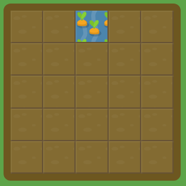

```css
#garden {
  display: grid;
  grid-template-columns: 20% 20% 20% 20% 20%;
  grid-template-rows: 20% 20% 20% 20% 20%;
}

#water {
  grid-column-start: 3;
}
```
NIVEL 2

Oh oh, parece que hay malas hierbas creciendo en la esquina de tu jardín. Usa `grid-column-start` para envenenarlas. Fíjate en que las malas hierbas comienzan en el quinto borde vertical de la cuadrícula.

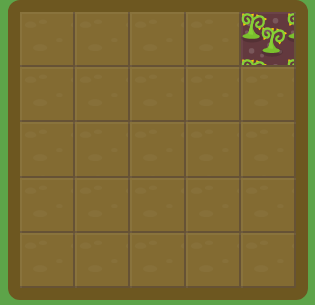

```css
#garden {
  display: grid;
  grid-template-columns: 20% 20% 20% 20% 20%;
  grid-template-rows: 20% 20% 20% 20% 20%;
}

#poison {
  grid-column-start: 5;
}
```

NIVEL 3

Cuando `grid-column-start` se usa solo, la expansión por defecto del elemento en la cuadrícula será de exactamente una columna. No obstante, puedes extender el elemento varias columnas añadiendo la propiedad `grid-column-end`.

Usando `grid-column-end`, riega todas las zanahorias evitando que se forme barro. ¡No queremos malgastar agua! Fíjate en que las zanahorias comienzan en el 1er borde vertical y terminan en el 4º.

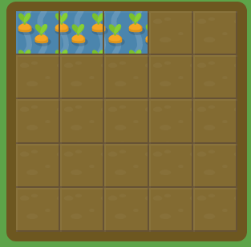

```css
#garden {
  display: grid;
  grid-template-columns: 20% 20% 20% 20% 20%;
  grid-template-rows: 20% 20% 20% 20% 20%;
}

#water {
  grid-column-start: 1;
  grid-column-end: 4;
}
```

NIVEL 4

Al emparejar `grid-column-start` y `grid-column-end`, podrías asumir que el valor final tiene que ser mayor que el valor inicial. ¡Pero no es el caso!

Intenta establecer `grid-column-end` a un valor inferior a 5 para regar tus zanahorias.

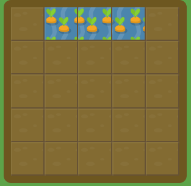

```css
#garden {
  display: grid;
  grid-template-columns: 20% 20% 20% 20% 20%;
  grid-template-rows: 20% 20% 20% 20% 20%;
}

#water {
  grid-column-start: 5;
  grid-column-end: 2;
}
```

NIVEL 5

Si prefieres contar las líneas de la cuadrícula comenzando por la derecha, puedes dar a `grid-column-start` y `grid-column-end` valores negativos. Por ejemplo, puedes establecerlos a -1 para indicar la primera línea comenzando por la derecha.

Intenta establecer `grid-column-end` a un valor negativo.

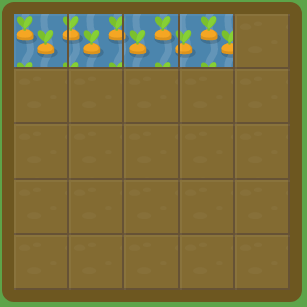

```css
#garden {
  display: grid;
  grid-template-columns: 20% 20% 20% 20% 20%;
  grid-template-rows: 20% 20% 20% 20% 20%;
}

#water {
  grid-column-start: 1;
  grid-column-end: 5;
}
```

NIVEL 6

Ahora intenta establecer `grid-column-start` a un valor negativo.

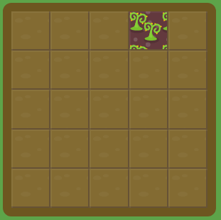

```css
#garden {
  display: grid;
  grid-template-columns: 20% 20% 20% 20% 20%;
  grid-template-rows: 20% 20% 20% 20% 20%;
}

#poison {
  grid-column-start: -3;
}
```

NIVEL 7

En lugar de definir un elemento en la cuadrícula basado en la posicion inicial y final, puedes definirlo basado en la longitud de columnas deseada usando la palabra clave `span`. Ten presente que `span` solo funciona con valores positivos.

Por ejemplo, riega las zanahorias usando `grid-column-end: span 2;`.

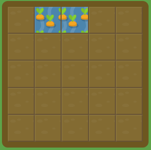

```css
#garden {
  display: grid;
  grid-template-columns: 20% 20% 20% 20% 20%;
  grid-template-rows: 20% 20% 20% 20% 20%;
}

#water {
  grid-column-start: 2;
  grid-column-end: span 2;
}
```

NIVEL 8

Intenta usar `grid-column-end` con la palabra clave `span` de nuevo para regar tus zanahorias.

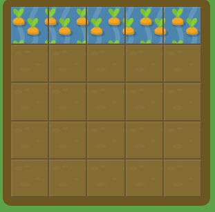

```css
#garden {
  display: grid;
  grid-template-columns: 20% 20% 20% 20% 20%;
  grid-template-rows: 20% 20% 20% 20% 20%;
}

#water {
  grid-column-start: 1;
  grid-column-end: span 5;
}
```

NIVEL 9

También puedes usar la palabra clave span con `grid-column-start` para establecer la anchura del elemento en relación a la posición final.

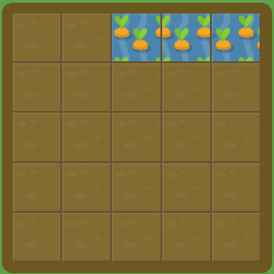

```css
#garden {
  display: grid;
  grid-template-columns: 20% 20% 20% 20% 20%;
  grid-template-rows: 20% 20% 20% 20% 20%;
}

#water {
  grid-column-start: span 3;
  grid-column-end: 6;
}
```

NIVEL 10

Escribir ambos `grid-column-start` y `grid-column-end` cada vez puede resultar cansado. Afortunadamente, `grid-column` es una propiedad abreviada que acepta ambos valores a la vez, separados por una barra oblicua.

Por ejemplo, `grid-column: 2 / 4;` establecerá el comienzo del elemento de la cuadrícula en la 2ª línea vertical de esta, y su final en la 4ª línea vertical.

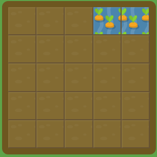

```css
#garden {
  display: grid;
  grid-template-columns: 20% 20% 20% 20% 20%;
  grid-template-rows: 20% 20% 20% 20% 20%;
}

#water {
  grid-column: 4/6;
}
```

NIVEL 11

Intenta usar `grid-column` para regar las zanahorias. La palabra clave span también funciona con esta propiedad abreviada así que ¡dale una oportunidad!

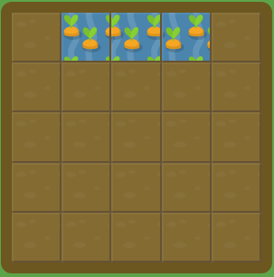

```css
#garden {
  display: grid;
  grid-template-columns: 20% 20% 20% 20% 20%;
  grid-template-rows: 20% 20% 20% 20% 20%;
}

#water {
  grid-column: 2/5
}
```

NIVEL 12

Una de las cosas que diferencia las cuadrículas de CSS de flexbox es que puedes posicionar los elementos fácilmente en 2 dimensiones: columnas y filas. `grid-row-start` funciona de manera semejante a `grid-column-start` pero a lo largo del eje vertical.

Usa `grid-row-start` para regar las zanahorias.

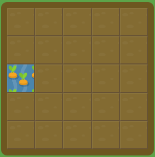

```css
#garden {
  display: grid;
  grid-template-columns: 20% 20% 20% 20% 20%;
  grid-template-rows: 20% 20% 20% 20% 20%;
}

#water {
  grid-row-start: 3;
}
```

NIVEL 13

Ahora dale una oportunidad a la propiedad abreviada `grid-row`.

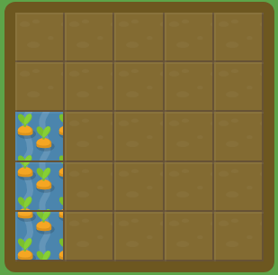

```css
#garden {
  display: grid;
  grid-template-columns: 20% 20% 20% 20% 20%;
  grid-template-rows: 20% 20% 20% 20% 20%;
}

#water {
  grid-row: 3 / 6;
}
```

NIVEL 14

Usa `grid-column` y `grid-row` a la vez para establecer una posición en ambas dimensiones.

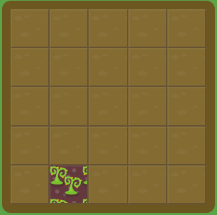

```css
#garden {
  display: grid;
  grid-template-columns: 20% 20% 20% 20% 20%;
  grid-template-rows: 20% 20% 20% 20% 20%;
}

#poison {
  grid-column: 2;
  grid-row: 5;
}
```

NIVEL 15

También puedes usar `grid-column` y `grid-row` juntos para abarcar áreas más extensas en la cuadrícula. ¡Inténtalo!

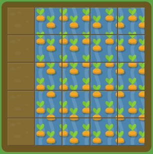

```css
#garden {
  display: grid;
  grid-template-columns: 20% 20% 20% 20% 20%;
  grid-template-rows: 20% 20% 20% 20% 20%;
}

#water {
  grid-column: 2/6;
  grid-row: 1/6
}
```

NIVEL 16

Si escribir `grid-column` y `grid-row` se te hace demasiado pesado, aquí tienes otra propiedad abreviada. `grid-area` admite cuatro valores separados por barras oblicuas: `grid-row-start`, `grid-column-start`, `grid-row-end`, seguido de `grid-column-end`.

Un ejemplo de esto podría ser `grid-area: 1 / 1 / 3 / 6;`.

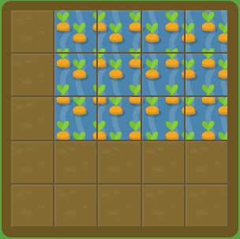

```css
#garden {
  display: grid;
  grid-template-columns: 20% 20% 20% 20% 20%;
  grid-template-rows: 20% 20% 20% 20% 20%;
}

#water {
  grid-area: 1/2/4/6
}
```

NIVEL 17

¿Y qué me dices de múltiples elementos? Puedes superponerlos sin problema. Usa `grid-area` para definir una segunda área que cubra todas las zanahorias que están sin regar.

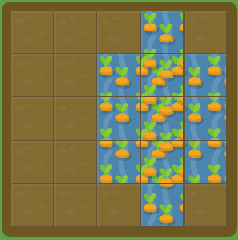

```css
#garden {
  display: grid;
  grid-template-columns: 20% 20% 20% 20% 20%;
  grid-template-rows: 20% 20% 20% 20% 20%;
}

#water-1 {
  grid-area: 1 / 4 / 6 / 5;
}

#water-2 {
  grid-area: 5/3/2/6
}
```

NIVEL 18

Si los elementos de la cuadrícula no se sitúan explícitamente con `grid-area`, `grid-column`, `grid-row`, etc., se sitúan automáticamente de acuerdo al orden en el código fuente. Puedes sobrescribir esto usando la propiedad order, que es una de las ventajas de la cuadrícula frente al diseño basado en tablas.

Por defecto, el valor de `order` de todos los elementos es igual a 0, pero puede ser establecido a cualquier valor positivo o negativo, de manera similar a `z-index`.

Ahora mismo, las zanahorias en la segunda columna están siendo envenenadas y las malas hierbas en la última columna, regadas. !Cambia el valor de `order` del veneno para solucionar esto!

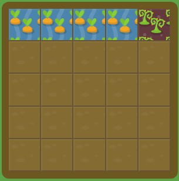

```css
#garden {
  display: grid;
  grid-template-columns: 20% 20% 20% 20% 20%;
  grid-template-rows: 20% 20% 20% 20% 20%;
}

.water {
  order: 0;
}

#poison {
  order: 4
}
```

NIVEL 19

Ahora el veneno y el agua se alternan, a pesar de que todas las malas hierbas están al comienzo de tu jardín. Cambia el valor de `order` de los venenos para solucionar esto.

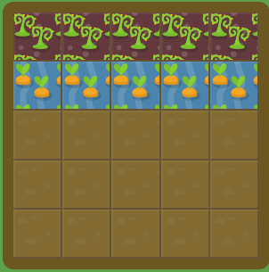

```css
#garden {
  display: grid;
  grid-template-columns: 20% 20% 20% 20% 20%;
  grid-template-rows: 20% 20% 20% 20% 20%;
}

.water {
  order: 0;
}

.poison {
  order: -1;
}
```

NIVEL 20

Hasta este momento, has tenido un jardín formado por cinco columnas, cada una ocupando el 20% de la anchura total, y cinco filas, cada una ocupando el 20% de la altura total.

Esto ha sido establecido con las propiedades `grid-template-columns: 20% 20% 20% 20% 20%;` y `grid-template-rows: 20% 20% 20% 20% 20%;`. Cada propiedad tiene cinco valores que crean cinco columnas, cada una establecida al 20% de la anchura total del jardín.

Pero puedes establecer los valores en la cuadrícula como quieras. Da a `grid-template-columns` un nuevo valor para regar tus zanahorias. Querrás que la anchura de la primera columna sea del 50%.

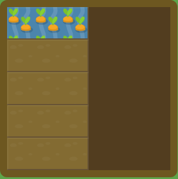

```css
#garden {
  display: grid;
  grid-template-columns: 50%;
  grid-template-rows: 20% 20% 20% 20% 20%;
}

#water {
  grid-column: 1;
  grid-row: 1;
}
```

NIVEL 21

Especificar un puñado de columnas con la misma anchura puede ser aburrido. Afortunadamente hay una función `repeat` que te ayudará con eso.

Por ejemplo, previamente hemos definido cinco columnas al 20% de anchura mediante `grid-template-columns: 20% 20% 20% 20% 20%;`. Esto puedes simplificarse como `grid-template-columns: repeat(5, 20%)`;

Usando `grid-template-columns` con la función `repeat`, crea ocho columnas, cada una con una anchura del 12.5%. De esta manera no inundarás tu jardín.

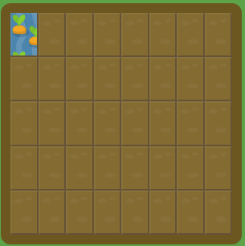

```css
#garden {
  display: grid;
  grid-template-columns: repeat(8, 12.5%);
  grid-template-rows: 20% 20% 20% 20% 20%;
}

#water {
  grid-column: 1;
  grid-row: 1;
}
```

NIVEL 22

`grid-template-columns` no acepta solo valores porcentuales, sino también otras unidades como pixels y ems. Incluso puedes mezclar diferentes unidades a la vez.

Establece tres columnas a `100px`, `3em`, y `40%` respectivamente.

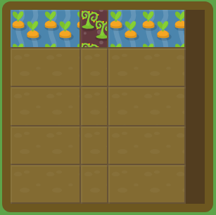

```css
#garden {
  display: grid;
  grid-template-columns: 100px 3em 40%;
  grid-template-rows: 20% 20% 20% 20% 20%;
}
```

NIVEL 23

CSS Grid también introduce una nueva medida, la fracción `fr`. Cada unidad `fr` asigna una porción del espacio disponible. Por ejemplo, si dos elementos están establecidos a `1fr` y `3fr` respectivamente el espacio se divide en 4 porciones iguales; el primer elemento ocupa 1/4 del espacio y el segundo elemento los 3/4 restantes.

Ahora las malas hierbas ocupan 1/6 de tu primera fila y las zanahorias los restantes 5/6. Crea dos columnas con ese ancho empleando `fr`  .

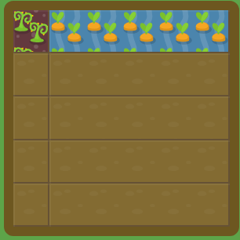

```css
#garden {
  display: grid;
  grid-template-columns: 1fr 5fr;
  grid-template-rows: 20% 20% 20% 20% 20%;
}
```

NIVEL 24

Cuando algunas columnas son establecidas en píxeles, porcentajes o ems, cualquier otra columna establecida con `fr` dividirá el espacio restante.

Aquí las zanahorias forman una columna de 50 píxeles a la izquierda, y las malas hierbas una columna de 50 píxeles a la derecha. Mediante `grid-template-columns`, crea esas dos columnas y usa `fr` para crear tres columnas más en el espacio que queda entre ellas.

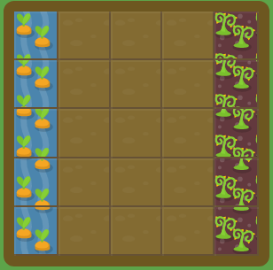

```css
#garden {
  display: grid;
  grid-template-columns: 50px 1fr 1fr 1fr 50px;
  grid-template-rows: 20% 20% 20% 20% 20%;
}

#water {
  grid-area: 1 / 1 / 6 / 2;
}

#poison {
  grid-area: 1 / 5 / 6 / 6;

```

NIVEL 25

Ahora hay una columna de malas hierbas de 75 píxeles en el lado izquierdo del jardín. En 3/5 del espacio restante crecen zanahorias, mientras que los 2/5 restantes han sido invadidos por malas hierbas.

Usa `grid-template-columns` con una combinación de px y fr para crear las columnas necesarias.

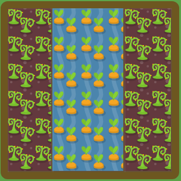

```css
#garden {
  display: grid;
  grid-template-columns: 75px 3fr 2fr;
  grid-template-rows: 100%;
}
```

NIVEL 26

`grid-template-rows` funciona exactamente igual que `grid-template-columns`.

Usa `grid-template-rows` para regar todo excepto los 50 píxeles de la parte superior de tu jardín. Fíjate que el agua se ha establecido para que llene solo la 5ª fila, por lo que tendrás que crear 5 filas en total.

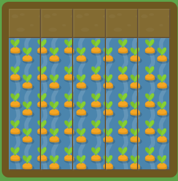

```css
#garden {
  display: grid;
  grid-template-columns: 20% 20% 20% 20% 20%;
  grid-template-rows: 50px 0px 0px 0px 1fr;
}

#water {
  grid-column: 1 / 6;
  grid-row: 5 / 6;
}
```

NIVEL 27

`grid-template` es una propiedad abreviada que combina `grid-template-rows` y `grid-template-columns`.

Por ejemplo, `grid-template: 50% 50% / 200px;` creará una cuadrícula con dos filas que ocuparán el 50% del alto cada una, y una columna que será 200 píxeles de ancho.

Prueba a usar `grid-template` para regar un área que incluya el 60% superior y 200 píxeles desde la izquierda en tu jardín.

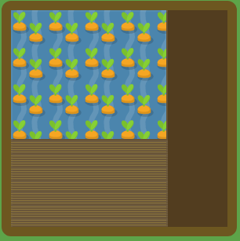

```css
#garden {
  display: grid;
  grid-template: 60% / 200px;
}

#water {
  grid-column: 1;
  grid-row: 1;
}
```

NIVEL 28

Tu jardín tiene una pinta genial. Esta vez se ha dejado un camino de 50 píxeles de ancho en el fondo de tu jardín y se ha llenado el resto con zanahorias.

Desafortunadamente, el 20% izquierdo de tus zanahorias han sido invadidas por malas hierbas. Usa CSS Grid una última vez para tratar tu jardín.

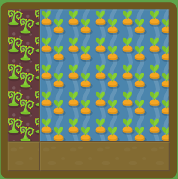

```css
#garden {
  display: grid;
  grid-template: 1fr 50px / 20% 80%;
}
}
```

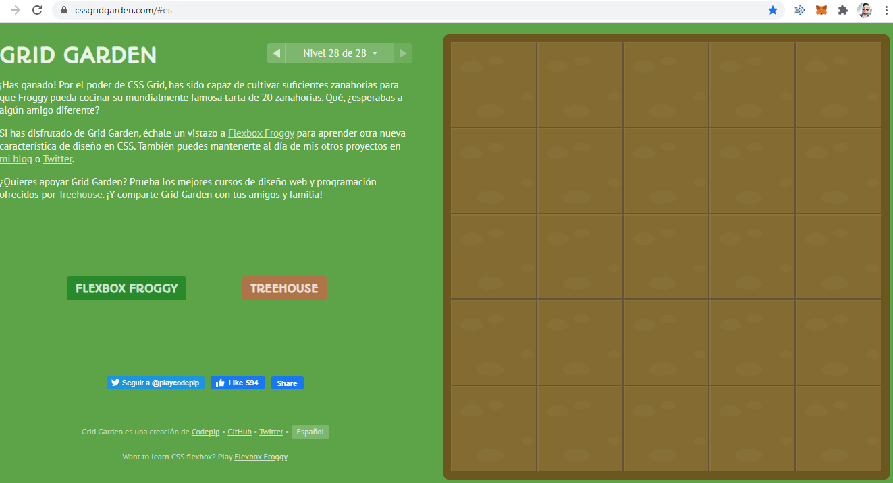